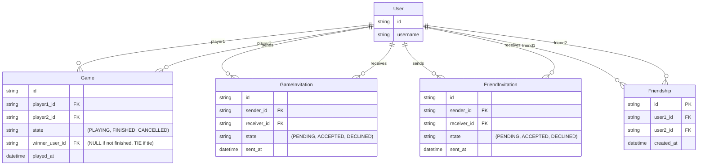

# Software Design Document

## Entity Relationship Diagram

```mermaid
erDiagram
    User {
        string id
        string username
    }

    Game {
        string id
        string player1_id FK
        string player2_id FK
        string state "(PLAYING, FINISHED, CANCELLED)"
        string winner_user_id FK "(NULL if not finished, TIE if tie)"
        datetime played_at
    }

    GameInvitation {
        string id
        string sender_id FK
        string receiver_id FK
        string state "(PENDING, ACCEPTED, DECLINED)"
        datetime sent_at
    }

    FriendInvitation {
        string id
        string sender_id FK
        string receiver_id FK
        string state "(PENDING, ACCEPTED, DECLINED)"
        datetime sent_at
    }

    Friendship {
        string id PK
        string user1_id FK
        string user2_id FK
        datetime created_at
    }

    User ||--o{ Game: "player1"
    User ||--o{ Game: "player2"
    User ||--o{ GameInvitation: "sends"
    User ||--o{ GameInvitation: "receives"
    User ||--o{ FriendInvitation: "sends"
    User ||--o{ FriendInvitation: "receives"
    User ||--o{ Friendship: "friend1"
    User ||--o{ Friendship: "friend2"
```

## Socket.io Events

### Client to Server

- `joinQueue`: Join the queue for a game

### Server to Client

